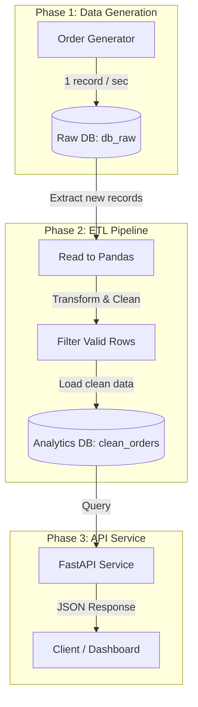

<div align="center">
  
  <h1>🛒 E-commerce Orders Monitoring Pipeline</h1>
  <p>
    <strong>A complete data engineering pipeline simulating, processing, and serving e-commerce orders</strong>
  </p>

  <!-- Badges -->
  <p>
    
    
    
    
  </p>
</div>

---

## 📖 Table of Contents
- [Project Overview](#project-overview)
- [Architecture](#architecture)
- [Tech Stack](#tech-stack)
- [Database Subsystems](#database-subsystems)
- [Getting Started](#getting-started)
- [Pipeline Execution](#pipeline-execution)
- [API Endpoints](#api-endpoints)

---

## 🚀 Project Overview

This project is an academic data engineering implementation that demonstrates the full lifecycle of data. It simulates real-time e-commerce order generation, builds a robust ETL (Extract, Transform, Load) pipeline to clean the data, and finally serves the analytical data through a high-performance RESTful API.

### 🌟 Key Features
1. **Real-time Data Generation**: Continuously generates mock orders directly into a raw database.
2. **Scheduled ETL Pipeline**: Custom script running continuously, transforming and validating data before moving it to analytics.
3. **Data Availability**: A FastAPI endpoint providing analytics and statistical insights in real time.

---

## 🏗️ Architecture

Below is the workflow showing how data transitions from raw generation to analytics:



---

## 🛠️ Tech Stack

| Component | Technology | Purpose |
| :--- | :--- | :--- |
| **Language** | `Python` | Core logic and scripting |
| **Database** | `PostgreSQL` | Storage for Raw & Analytical data |
| **ETL Processing** | `Pandas` | Data extraction, cleaning, and transformation |
| **API Framework** | `FastAPI` | Serving the clean data via REST APIs |
| **Mock Data** | `Faker` | Generating realistic e-commerce synthetic data |
| **Task Scheduling**| `schedule` | Running the pipelines autonomously |

---

## 🗄️ Database Subsystems

### 1. Raw Data (`db_raw`)
Acts as the **Staging Area** (Raw Storage). Only accepts insertions from the Order Generator.
* **Table**: `raw_orders` 
* **Columns**: `order_id`, `user_id`, `product_id`, `quantity`, `price`, `status`, `created_at`

### 2. Analytics Data (`analytics`)
Acts as the **Analytical Database** (Data Target). Contains exclusively validated and cleaned rows from the pipeline.
* **Table**: `clean_orders`
* **Additional Columns**: `processed_at` (Timestamp of when the ETL ran)

> **💡 Design Decision**: Instead of unnecessarily duplicating raw data into the `analytics` database, we maintain `db_raw` as the single source of truth for uncleaned data, and keep only curated records in `analytics`. This ensures optimized storage and cleaner academic explanations.

---

## 🏁 Getting Started

### 1. Prerequisites
- Python 3.9+
- PostgreSQL server running locally or remotely

### 2. Clone the Repository
```bash
git clone https://github.com/mohbds1/de-bootcamp-training/ecommerce-pipeline-project.git
cd ecommerce-pipeline-project
```

### 3. Environment Setup
Create a virtual environment and install dependencies:

**Windows Command Prompt / PowerShell:**
```bash
python -m venv .venv
.venv\Scripts\activate
```

**macOS / Linux:**
```bash
python3 -m venv .venv
source .venv/bin/activate
```

Install Packages:
```bash
pip install -r requirements.txt
```

### 4. Configuration
Create a `.env` file in the root directory (you can copy `.env.example`) and configure your PostgreSQL connection credentials:
```ini
RAW_DB_HOST=localhost
RAW_DB_PORT=5432
RAW_DB_NAME=db_raw
RAW_DB_USER=postgres
RAW_DB_PASSWORD=your_password

ANALYTICS_DB_HOST=localhost
ANALYTICS_DB_PORT=5432
ANALYTICS_DB_NAME=analytics
ANALYTICS_DB_USER=postgres
ANALYTICS_DB_PASSWORD=your_password
```

Create the required databases in your PostgreSQL server:
```sql
CREATE DATABASE db_raw;
CREATE DATABASE analytics;
```

---

## ⚙️ Pipeline Execution

This project is built to run continuously. You will need **three separate terminal windows** to run the components simultaneously. Make sure the virtual environment is activated in each terminal.

### Terminal 1: Data Generator
Generates one order per second and loads it directly into the `raw_orders` table.
```bash
python generator/generate_orders.py
```

### Terminal 2: ETL Pipeline
Runs every 1 minute. Extracts new rows, drops bad data (e.g., negative prices/quantities), and loads valid data into the `clean_orders` table. It uses an internal state file (`.pipeline_state.json`) to track the last processed `order_id` safely.
```bash
python pipeline/pipeline.py
```

### Terminal 3: API Service
Hosts the data via FastAPI.
```bash
uvicorn api.main:app --reload
```

---

## 📡 API Endpoints

Once the API is running (usually on `http://127.0.0.1:8000`), you can access the automatic interactive docs (Swagger UI) at:
👉 **[http://127.0.0.1:8000/docs](http://127.0.0.1:8000/docs)**

### `GET /orders/latest`
Returns the 10 most recently processed clean orders.
```json
{
  "orders": [
    {
      "order_id": 105,
      "user_id": 42,
      "product_id": 89,
      "quantity": 2,
      "price": 120.50,
      "status": "paid",
      "created_at": "2026-03-27T10:00:00",
      "processed_at": "2026-03-27T10:01:00"
    }
  ]
}
```

### `GET /orders/stats`
Returns aggregated analytics over the last hour.
```json
{
  "orders_last_hour": 60,
  "total_sales": 2540.50,
  "status_distribution": {
    "paid": 25,
    "shipped": 20,
    "created": 15
  }
}
```

---
<p align="center">
  <i>Prepared and built as an academic Data Engineering demonstration project.</i>
</p>
