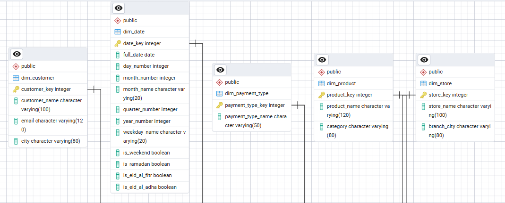
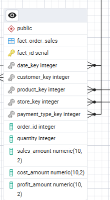
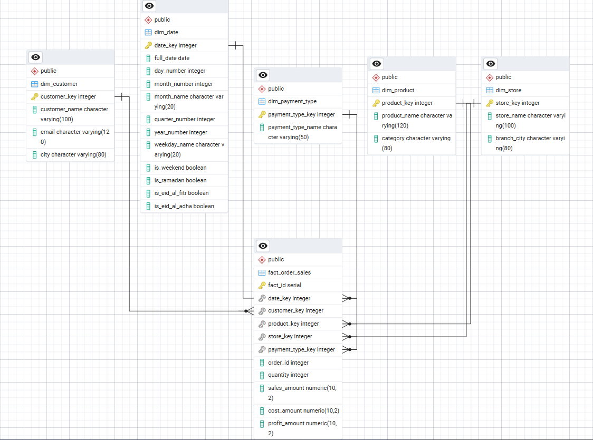
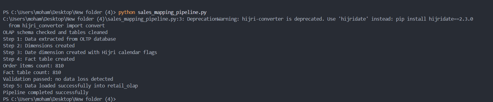
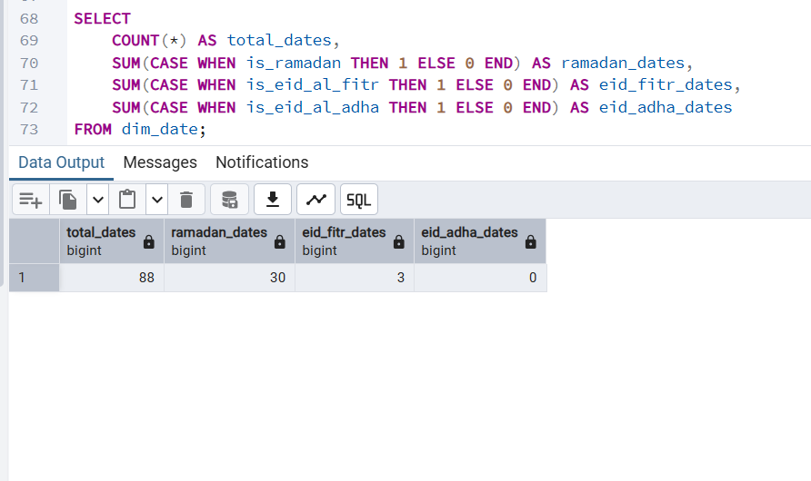
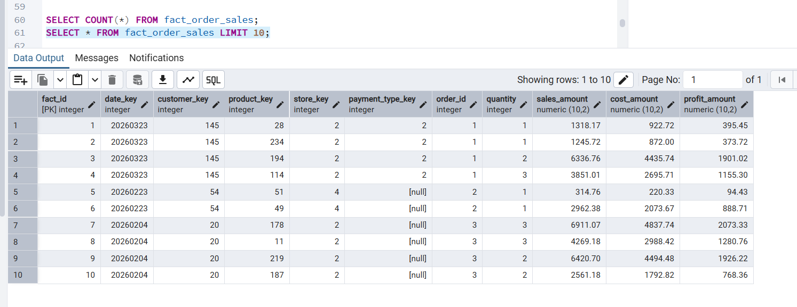

# Retail Orders Analytics Pipeline

A simple ETL and data warehouse project developed as part of Data Engineering training.

## Project Overview

This project is a simple Data Engineering pipeline that transfers sales data from an OLTP database into an OLAP data warehouse using Python and Pandas.

The main purpose of the project is to practice:

- Data mapping
- Fact table creation
- Building a simple pipeline using Pandas
- Moving data from OLTP to OLAP
- Handling dates correctly

The project does not use Slowly Changing Dimensions (SCD) because the requirement focuses only on mapping and analytical modeling.

---

## Project Architecture

```text
OLTP Database (retail_oltp)
        |
        |  Extract using Pandas
        v
Python Mapping Pipeline
        |
        |  Transform data and build dimensions
        v
OLAP Database (retail_olap)
```

---

## Source Database Tables

The OLTP database contains transactional tables such as:

- users
- products
- brands
- categories
- branches
- payment_methods
- orders
- order_items
- payments

These tables simulate a small e-commerce system.

---

## Data Warehouse Tables

The OLAP database uses a simple star schema.

### Dimension Tables

- dim_customer
- dim_product
- dim_store
- dim_payment_type
- dim_date

### Fact Table

- fact_order_sales

The fact table stores business measurements like:

- quantity
- sales amount
- cost amount
- profit amount

---

## Date Handling

Date handling was one of the main parts of this project.

The pipeline converts the order date into a date key using the format:

```text
YYYYMMDD
```

Example:

```text
2026-03-23 → 20260323
```

This key is used in both:

- dim_date
- fact_order_sales

This makes joining the fact table with the date dimension easier and more accurate.

The date dimension also contains:

- day number
- month number
- month name
- quarter number
- year number
- weekday name
- weekend flag
- Ramadan flag
- Eid Al-Fitr flag
- Eid Al-Adha flag

The project also applies Hijri calendar logic to detect important Islamic events such as Ramadan and Eid holidays.

---

## Pipeline Process

The pipeline performs the following steps:

1. Connect to the OLTP database.
2. Read source tables using Pandas.
3. Build dimension tables.
4. Generate the date dimension.
5. Create the fact table.
6. Calculate sales, cost, and profit.
7. Validate that no records were lost.
8. Load the final tables into the OLAP database.

---

## Fact Table Calculations

The pipeline calculates the following values:

```text
sales_amount = quantity × selling price

cost_amount = quantity × purchase price

profit_amount = sales_amount - cost_amount
```

---

## Islamic Calendar Features

One of the additional features implemented in this project is Hijri calendar handling.

The pipeline converts Gregorian dates into Hijri dates using the Python library:

```text
hijri-converter
```

This allows the date dimension to automatically identify:

* Ramadan days
* Eid Al-Fitr days
* Eid Al-Adha days

These flags can later help businesses perform seasonal sales analysis and holiday-based reporting.

---

## Validation

A simple validation step was added to ensure that no records were lost during the mapping process.

The pipeline compares:

- Number of rows in order_items
- Number of rows in fact_order_sales

Result:

```text
Order items count: 810
Fact table count: 810
Validation passed successfully
```

This confirms that the transformation process completed correctly.

---

## Why SCD Was Not Used

Slowly Changing Dimensions were not implemented because the project requirement focuses mainly on:

- Mapping
- Fact table creation
- Pandas pipeline
- OLTP to OLAP loading
- Date handling

---

## How to Run the Project

### Dependencies

Install Python packages:

```bash
pip install -r requirements.txt
```

### Configuration

Database URLs are read from environment variables (no passwords in code):

- `RETAIL_OLTP_URL` — SQLAlchemy URL for the OLTP database `retail_oltp`
- `RETAIL_OLAP_URL` — SQLAlchemy URL for the OLAP database `retail_olap`

Copy `.env.example` to `.env`, edit the URLs with your PostgreSQL user, password, host, and port, then run the pipeline. The `.env` file is listed in `.gitignore` so it is not committed.

### Step 1

Create the OLTP database and tables.

### Step 2

Create the OLAP star schema tables.

### Step 3

Run the Python pipeline:

```bash
python sales_mapping_pipeline.py
```

---

## Final Output

After running the pipeline, the OLAP database contains:

- Customer dimension
- Product dimension
- Store dimension
- Payment type dimension
- Date dimension
- Sales fact table

The final warehouse model can be used later for:

- Sales analysis
- Monthly and quarterly reporting
- Product performance analysis
- Store performance analysis
- Seasonal and Ramadan sales analysis
- Business intelligence dashboards

---

## Screenshots

### Date Dimension



### Fact Table



### Star Schema Diagram



### Pipeline Execution



### Validation — counts



### Validation — pipeline output


