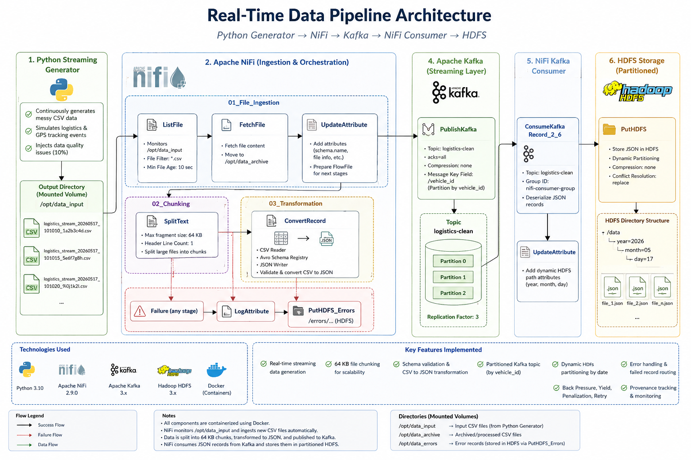

# Real-Time Logistics Data Pipeline

A real-time streaming data engineering project built using Apache NiFi, Apache Kafka, and Hadoop HDFS.

This project simulates a smart logistics tracking environment where shipment and vehicle telemetry data are continuously generated, processed, streamed, validated, and stored inside a distributed big data architecture.

The pipeline was designed to demonstrate practical data engineering concepts including:

- Real-time data ingestion
- Streaming ETL workflows
- File chunking
- Schema-based validation
- Kafka streaming
- Distributed HDFS storage
- Monitoring and reliability handling
- Failed record management

---

# Project Architecture



---

# Technologies Used

| Technology | Purpose |
|---|---|
| Python | Streaming data generation |
| Apache NiFi | Data ingestion and orchestration |
| Apache Kafka | Distributed event streaming |
| Hadoop HDFS | Distributed storage |
| Docker & Docker Compose | Infrastructure containerization |

---

# Pipeline Workflow

```text
Python Streaming Generator
        ↓
CSV Streaming Files
        ↓
Apache NiFi
        ↓
64 KB File Chunking
        ↓
CSV to JSON Transformation
        ↓
Apache Kafka
        ↓
Apache NiFi Consumer
        ↓
HDFS
```

---

# Project Structure

```text
real-time-logistics-data-pipeline/
│
├── custom_nars/
│
├── data/
│   ├── input/
│   ├── errors/
│
├── docker/
│   ├── docker-compose-kafka.yml
│   └── docker-compose-nifi-hadoop.yml
│
├── docs/
│   ├── Diagram.png
│   ├── architecture_diagram.md
│   └── technical_documentation.pdf
│
├── generator/
│   └── logistics_stream_generator.py
│
├── hadoop/
│   ├── core-site.xml
│   ├── hdfs-site.xml
│   └── hdfs_commands.md
│
├── kafka/
│   ├── consumer_config.properties
│   ├── producer_config.properties
│   └── create_topics.sh
│
├── nifi/
│   ├── flow_export/
│   └── AvroSchemaRegistry.txt
│
├── screenshots/
│
├── .gitignore
│
└── README.md
```

---

# Key Features

## Real-Time Streaming Generator

A custom Python generator continuously creates streaming logistics CSV files containing:

- Vehicle telemetry
- Shipment tracking
- GPS coordinates
- Delivery status
- Driver information

The generator also injects intentionally corrupted records to test pipeline reliability and validation handling.

---

## Apache NiFi Ingestion Pipeline

The ingestion layer was implemented using:

```text
ListFile → FetchFile
```

This design improves scalability and avoids partially written file ingestion.

The NiFi flow includes:

- Incremental ingestion
- Queue monitoring
- Back Pressure handling
- Retry mechanisms
- Failure routing
- Provenance tracking

---

## 64 KB File Chunking

Large incoming files are automatically divided into smaller fragments using the `SplitText` processor.

Benefits:

- Better streaming performance
- Reduced memory pressure
- Improved Kafka publishing efficiency

---

## CSV to JSON Transformation

Streaming CSV records are validated using schema-aware readers and then converted into JSON using:

- CSVReader
- ConvertRecord
- JsonRecordSetWriter

Malformed records are isolated and redirected into error handling flows.

---

## Apache Kafka Streaming

Validated JSON records are published into a distributed Kafka topic:

```text
logistics-clean
```

The topic was configured using:

- 3 partitions
- Replication factor 3

Partitioning is based on:

```text
vehicle_id
```

to preserve event ordering for each delivery vehicle.

---

## HDFS Distributed Storage

Final processed records are stored inside Hadoop HDFS using dynamic date partitioning.

Example structure:

```text
/data/year=2026/month=05/day=17/
```

This structure improves organization and supports future Hive or Spark integration.

---

# Monitoring & Reliability

The pipeline includes several reliability mechanisms:

- Queue monitoring
- Back Pressure thresholds
- Penalization and retry handling
- Error isolation
- Failed record storage
- Provenance tracking

Invalid records are automatically redirected into dedicated error paths inside HDFS.

---

# Screenshots

Project screenshots are available inside the `screenshots/` directory.

Examples include:

- NiFi process groups
- Kafka UI
- HDFS structure
- Queue monitoring
- Error handling flow
- Provenance events

---

# Challenges Faced

Several real-world engineering issues were encountered during implementation, including:

- Hadoop hostname configuration
- PutHDFS compatibility with latest NiFi versions
- Docker container networking
- Kafka cluster configuration
- HDFS permission handling
- Schema validation failures

These issues were resolved through infrastructure troubleshooting and iterative pipeline refinement.

---

# Future Improvements

Potential future enhancements include:

- Spark Streaming integration
- Hive external tables
- Grafana monitoring dashboards
- Kafka Schema Registry
- Dead Letter Queue implementation
- Real-time analytics layer